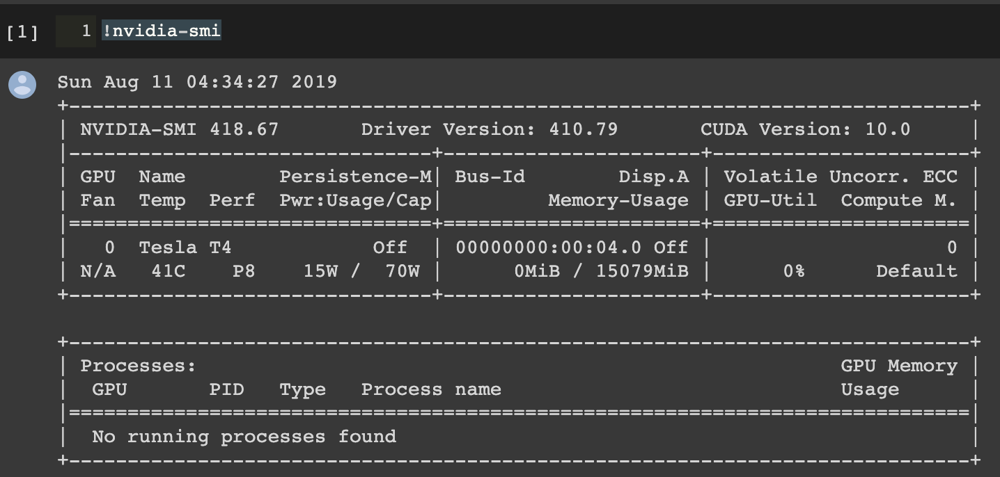

# Jax&Flax ResNet18 Classification Experiment

## Motivation
Constructing deep learning architectures with many layers is expensive as a lot of calculations, such as backpropagation, are needed. One of the solutions is to use Julia, which uses Just-In-Time. However, it does not have a debugging tool because it is not mature enough. Jax and Flax are neural networks for Python, and they use Just-In-Time compilation while training. Thus, Jax and Flax boost training time rapidly. This project reveals Jax and Flax potential with a cat&dog dataset and points out issues.

## 1.Requirements
- Python ==> 3.8
- Flax ==> 0.5.3
- Jax ==> 0.3.14
- Optax ==> 0.1.3
- Torch
- Numpy

## 2.Dataset
Binary Images: [Link](https://drive.google.com/drive/folders/1RoBdT1k3JI4QMNXOkAx46DxAy-fxMiyO?usp=sharing) Cats 70MB, Dog 90MB  
Sample Image of Cats [0] and Dogs [1]: 

 

## 3.Demo
The video shows the actual execution with Jax and Flax.

https://user-images.githubusercontent.com/52090852/182778858-e51c2f0c-5f53-4ffb-85e0-b63ed5130408.mp4

## 4.Results
| Model | Total Time | Epoch | Test Accuracy |
|:---|:---:|:---:|---:|
|Flax & Jax | 1200 sec | 2 | 0.609 |
|Flax & Jax | 130 sec | 5 | 0.682 |

There is a huge gap between the results. The first row shows that the total time is over 1200 seconds. On the other hand, the second row shows that the total time is around 130 seconds. This is Flax and Jax using Just-In-Time compilation. Thus, the first row (the first run) transferred all the data on the GPU. Then, from the second execution, the data stays on the GPU and reduces the total execution time.

## 5.Issues
The experiment uses around 160 MB of data for training. However, the usage of the RAM on the GPU achieved 13.99 GB (assume the maximum) easily when I used ResNet18. Thus, we need to be careful of the usage when we work with Flax and Jax, and we should keep in mind that the first execution will be slower in our minds.  

